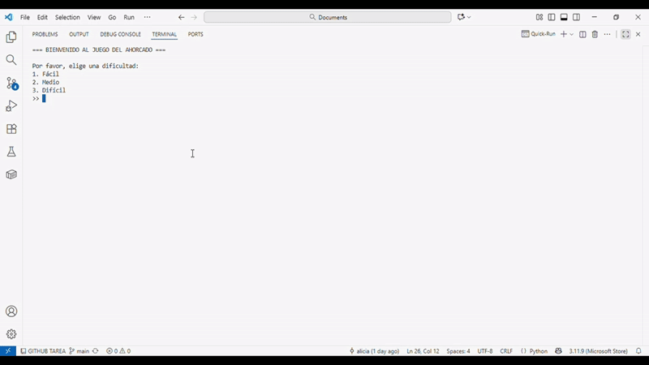

## PROYECTO FINAL INTEGRADOR 

## Juego del Ahorcado :video_game:

### Datos del proyecto
| | |
|---|---|
| **Nombre del Proyecto** | Juego del Ahorcado |
| **Estudiante** | Nataly Tituaña |
| **Fecha** | 18 de octubre de 2025 |
| **Materia** | Lógica de Programación |
| **Docente** | Mgtr. Lilian Aman |

---
## Descripción del Juego

Este juego, desarrollado en Python, desafía al jugador a adivinar una palabra relacionada con la tecnología mediante intentos guiados. Durante la partida, recibe pistas visuales y mensajes que reflejan su avance, fomentando su concentración.

## Objetivo del Programa

Desarrollar un juego del ahorcado donde el jugador deba adivinar una palabra secreta relacionada con la tecnología.  
A través de este programa, se busca demostrar el dominio de los conceptos básicos de la programación vistos a lo largo de las 4 unidades de la materia, como:  variables, listas, valores booleanos, condicionales, bucles y funciones.

### Cómo funciona:
- Al iniciar, el jugador elige un **nivel de dificultad**: Fácil, Medio o Difícil, que determina la lista de palabras posibles.  
- El programa selecciona una palabra secreta **aleatoriamente** y muestra la cantidad de letras con `_`.  
- El jugador adivina una letra por turno. El juego valida la entrada para asegurarse de que sea **una letra válida** y que no haya sido adivinada antes.  
- Cada letra correcta se revela en su posición correspondiente; cada letra incorrecta **reduce los intentos restantes** y se dibuja el ahorcado en la consola progresivamente.  
- El jugador puede usar **una pista** por juego, revelando una vocal o consonante a cambio de un intento.  
- El juego finaliza cuando el jugador **adivina la palabra** o se **quedan sin intentos**, mostrando un mensaje de victoria o derrota.  

---




---

## Metodología de Desarrollo

El desarrollo del proyecto se realizó en **tres fases**, siguiendo una metodología de diseño, lógica e implementación gradual del código.

El proyecto se realizó siguiendo un enfoque por etapas, alineado con las dos tareas autónomas entregadas y la implementación final. Este método permitió pasar de una idea abstracta a un producto de software funcional y estructurado.

#### Fase 1: Arquitectura y Diseño Conceptual 
**Generación de Diagramas Funcionales y Arquitectura de Software**

En esta fase se definió la arquitectura y la estructura conceptual del software, estableciendo las bases del proyecto antes de la implementación. 

* **Diagrama de Secuencia UML (Lucidchart):** Se modeló la interacción cronológica entre el Jugador y el Sistema, mostrando el flujo de mensajes y eventos desde el inicio hasta el final de una partida.


* **Diagrama de Arquitectura en Capas (Miro):** Se diseñó la estructura general de la aplicación para separar la lógica interna de la interfaz de usuario.


#### Fase 2: Diseño Lógico y Desarrollo Inicial 
**Inicio del Desarrollo de Software y Configuración del Entorno**

En esta fase, se tradujo el concepto a un plan de ejecución detallado y se comenzó la codificación:

* **Configuración del Entorno:** Se configuró el ambiente de desarrollo utilizando Visual Studio Code y se creó este repositorio en GitHub para el control de versiones.
* **Diagrama de Flujo (Lucidchart):** Se diseñó el algoritmo detallado del juego, mostrando el flujo de control, las decisiones y los bucles. Este diagrama sirvió como guía directa para la programación.
  **Diagrama de flujo:** [Lucidchart](https://lucid.app/lucidchart/3ac31a96-8734-4ff6-9c49-fb3361da6b47/edit?viewport_loc=-7562%2C-1675%2C13863%2C5763%2C0_0&invitationId=inv_f42f4575-937e-44c2-919a-972e5b8c77db)
* **Primer Prototipo:** Se implementó la lógica principal del diagrama de flujo en Python, creando una primera versión funcional del juego.


#### Fase 3: Implementación Final y Refinamiento
**Proyecto Integrador Final**

La última etapa consistió en completar el código y, sobre todo, mejorar la experiencia de usuario (UX). Se tomaron las bases de las fases anteriores y se añadieron las siguientes funcionalidades para crear un producto final más robusto e interactivo:

* **Niveles de Dificultad:** Se añadió un menú para que el jugador elija entre los modos Fácil, Medio y Difícil.
* **Sistema de Pistas:** Se implementó una opción para que el jugador pueda solicitar una pista a cambio de un intento.
* **Modularización del Código:** El programa se reestructuró en funciones claras (`seleccionar_palabra`, `dibujar_ahorcado`, etc.) para mejorar la legibilidad y el mantenimiento.
* **Retroalimentación Mejorada:** Se mejoraron los mensajes en consola y las validaciones de entrada para guiar mejor al usuario.

---

##  Principales Funcionalidades

| Funcionalidad | Descripción |
|---------------|------------|
| **Selección aleatoria de palabras** | El juego elige automáticamente una palabra secreta según el nivel de dificultad seleccionado (Fácil, Medio o Difícil). |
| **Niveles de dificultad** | Fácil, Medio y Difícil. El nivel determina la longitud y complejidad de la palabra, haciendo el juego más desafiante. |
| **Dibujo progresivo del ahorcado** | Cada error actualiza visualmente el ahorcado, mostrando el progreso del jugador y los intentos fallidos. |
| **Control de intentos** | El jugador tiene un máximo de 6 intentos; cada letra incorrecta reduce los intentos restantes. |
| **Validación de letras ingresadas** | Se asegura de que el jugador ingrese una sola letra válida que no haya sido usada previamente. |
| **Registro de letras incorrectas** | Muestra las letras fallidas para que el jugador pueda llevar un seguimiento de sus intentos. |
| **Sistema de pistas** | Permite revelar una letra (vocal o consonante) a cambio de un intento. Solo se puede usar una vez por juego. |
| **Retroalimentación inmediata** | Cada letra ingresada indica si es correcta o incorrecta, y actualiza el progreso y los intentos restantes. |
| **Finalización automática del juego** | Termina cuando el jugador adivina la palabra o se queda sin intentos, mostrando un mensaje de victoria o derrota. |

---

## Requisitos No Funcionales y Usabilidad

### Requisitos No Funcionales

- **Usabilidad:** Juego fácil de usar con instrucciones claras en consola.  
- **Retroalimentación:** Aciertos, errores e intentos se muestran al instante.  
- **Mensajes de error:** Alertas al ingresar letras inválidas o repetidas.  
- **Claridad visual:** Texto organizado y separado por líneas.  
- **Resultados finales:** Se indica si se ganó o perdió y se revela la palabra.  
- **Rendimiento:** Funciona rápido y con bajo consumo de memoria.
  
---

## Requisitos y Dependencias

- **Lenguaje:** Python 3.10 o superior  
- **Sistema Operativo:** Windows, macOS o Linux  
- **Librerías Externas:** Ninguna  

---

## Herramientas y Tecnologías Utilizadas

* **Software de Diagramación:** [Lucidchart](https://www.lucidchart.com)
* **Lenguaje de Programación:** Python 3
* **Editor de Código:** [Visual Studio Code](https://code.visualstudio.com/)

---

## Cómo Ejecutar el Proyecto

1. Asegurarse de tener **Python 3.10 o superior** instalado en su computadora.  
2. Abrir una terminal o consola.  
3. Navegar hasta la carpeta donde guardó el archivo del proyecto.  
4. Ejecutar el siguiente comando:  
   ```bash
   python "JUEGO DEL AHORCADO.py"
   
---
Gracias por su atención :smile:
